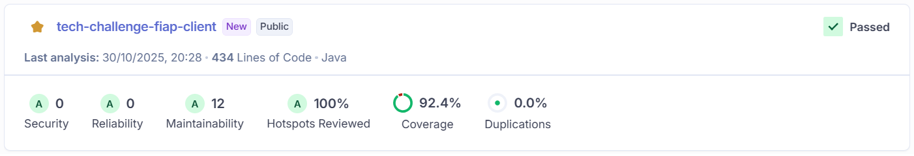

# 🧾 Client Microservice - Tech Challenge

## 📖 Sobre o projeto

O Client Microservice é o serviço de clientes do **Fast Food FIAP** para a fase 4 do Tech Challenge, implementado em Java 21 com Spring Boot 3, seguindo princípios de Arquitetura Hexagonal. Ele expõe operações REST para CRUD de clientes, valida dados de entrada, persiste em MongoDB e entrega contratos claros de erro.


## 📌 Estrutura de Endpoints do Microsserviço de Clientes

| Método        | Endpoint              | Descrição                       |
| --------------| ----------------------| --------------------------------|
| GET           | /v1/clients           | Lista todos os clientes         |
| GET           | /v1/clients/{id}      | Obtém um cliente pelo ID        |
| POST          | /v1/clients           | Cria um novo cliente            |
| PUT           | /v1/clients/{id}      | Atualiza os dados de um cliente |
| DELETE        | /v1/clients/{id}      | Remove um cliente pelo ID       |

## 🏛️ Arquitetura Hexagonal

### O que é?

A Arquitetura Hexagonal, também conhecida como Ports & Adapters, separa a lógica de negócio (Domínio) das preocupações externas (web, banco, mensageria, etc.). O objetivo é manter o núcleo da aplicação independente de frameworks, bancos de dados e interfaces, aumentando testabilidade, manutenção e evolução.

### Por que é uma boa escolha para microsserviços?

- **Baixo acoplamento** - facilita a substituição de tecnologias externas
- **Testabilidade** - facilita a testabilidade da aplicação
- **Evolução segura** - permite evolução do microsserviço sem afetar os demais
- **Manutenção** - facilita a manutenção da aplicação
- **Flexibilidade/Isolamento** - permite a adição de novas tecnologias externas sem afetar o núcleo da aplicação

### Como está aplicada neste projeto?

- **Domínio** - Regras centrais em domain/ (ex.: ClientEntity, normalização/validação de CPF, exceções).
- **Aplicação/Portas** - Orquestração em application/ (ex.: ClientUseCase e ClientService), expondo portas de entrada e consumindo portas de saída.
- **Adapters In** - Interface REST em adapters/in/ (ex.: ClientController, DTOs/mappers ClientInMapper, tratamento de erros adapters/in/exception/GlobalExceptionHandler).
- **Adapters Out** - Persistência em adapters/out/ (ex.: ClientGatewayMongoAdapter implementa a porta de saída, MongoClientRepository do Spring Data, mapeador 
ClientOutMapper).

## 💾 MongoDB

MongoDB é um banco de dados **NoSQL** orientado a documentos que armazena dados em JSON/BSON, oferecendo um modelo flexível de esquema que facilita a evolução do domínio sem migrações complexas e com ótima aderência a APIs REST que trocam payloads em JSON. 
Essa flexibilidade torna o desenvolvimento mais rápido e tolerante a mudanças de requisitos, enquanto a estrutura de documentos modela naturalmente agregados do negócio, reduzindo a necessidade de joins e simplificando consultas. Com replicação e sharding nativos, o MongoDB escala horizontalmente e oferece alta disponibilidade, atendendo bem a serviços que podem crescer em volume de tráfego e dados. 
Além disso, a integração com Spring Data MongoDB agiliza o acesso a dados, repositórios e mapeamento, acelerando a entrega com menos código e maior produtividade — um encaixe sólido para este projeto, que prioriza agilidade, evolução contínua e desempenho em operações de leitura e escrita.

## 📊 SonarQube

SonarQube é uma ferramenta de análise estática de código que ajuda a identificar e corrigir problemas de qualidade no código-fonte, como vazamentos de memória, erros de sintaxe, bugs e vulnerabilidades de segurança. Ele também ajuda a manter o código limpo e organizado, facilitando a manutenção e evolução do código ao longo do tempo. 

Segue abaixo a cobertura de código desse projeto:



## ⚙️ Tecnologias utilizadas

- **Java 21**: linguagem de programação moderna utilizada para implementar o microsserviço.
- **Spring Boot**: framework Java para criação de aplicações web e APIs com convenções e auto-configuração.
- **Spring Web**: módulo do Spring para construção de endpoints REST.
- **Spring Validation**: validação de dados de entrada com anotações e Bean Validation.
- **Spring Data MongoDB**: integração e acesso a dados em MongoDB de forma simplificada.
- **MongoDB**: banco de dados NoSQL para persistência dos clientes.
- **Springdoc OpenAPI**: geração de documentação OpenAPI/Swagger para a API.
- **JUnit 5**: framework de testes unitários.
- **Mockito**: biblioteca de mocks para isolar dependências nos testes.
- **Cucumber & Gherkin**: ferramenta que segue a metodologia BDD (Behavior-Driven Development) para a escrita de testes de aceitação.
- **JaCoCo**: ferramenta de cobertura de código.
- **SonarQube/SonarCloud**: análise estática de código e quality gate.
- **Docker & Docker Compose**: Ferramentas para containerização da aplicação e do banco de dados, facilitando o ambiente de desenvolvimento.
- **Kubernetes**: Orquestrador de containers para deploy e gerenciamento da aplicação em um ambiente de produção.
- **GitHub Actions**: automação de CI/CD.

## 🚀 Como Executar Localmente

### Pré-requisitos

- **Java 21 (JDK)**: instalar e configurar JAVA_HOME.
- **Maven**: para build e execução de testes (mvn clean verify).
- **Docker e Docker Compose**: para containerização da aplicação e banco de dados.
- **Kubernetes**: Um cluster para o deploy. Pode ser um cluster local como Minikube ou o Kubernetes integrado ao Docker Desktop.
- **kubectl**: A ferramenta de linha de comando do Kubernetes, configurada para interagir com seu cluster.

### Passo a Passo

1. **Clone o repositório**

   ```bash
   git clone git@github.com:LucasMachadoID2/tech-challenge-fiap-client.git
   cd tech-challenge-fiap-client

   ```

2. **Aplique os manifestos Kubernets**

   ```bash
   kubectl apply -f k8s/

   ```

4. **Confirme se tudo esta rodandos**

   ```bash
   watch kubectl get all

   ```

5. **Para acessar a aplicação:**

   ```bash
   http://localhost:8080/swagger-ui/index.html
   ```

<br>

## 🙋‍♀️ Equipe

| Nome                               | RA     | Nome Discord                 |
| ---------------------------------- | ------ | ---------------------------- |
| Danilo Augusto Pereira             | 364411 | Danilo Augusto - RM364411    |
| Gabriela Trindade Ferreira         | 364756 | Gabriela Ferreira - RM364756 |
| Guilherme Garcia Dos Santos Moraes | 364613 | Guilherme Garcia - RM364613  |
| Lucas Matheus Monteiro Machado     | 361059 | Lucas Machado - RM361059     |
| Marjory Bispo Matos                | 361150 | Marjory Matos - RM361150     |

```

```
